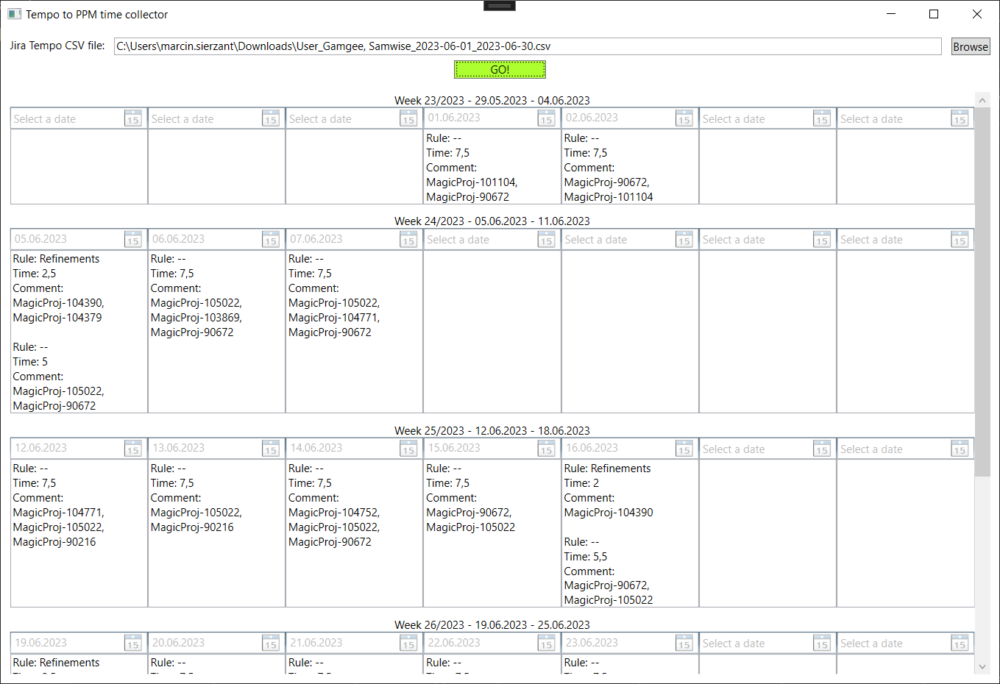
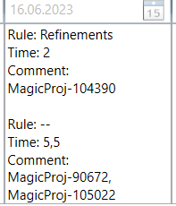

# TempoPpmCollector

This is simple, crude app to collect Jira-Tempo monthly report in CSV format and present it in easily manageable text meant for SAP PPM time reporting.

Yes, there is no MVVM, DI and all other WPF magic.



## Processed data

App reads 4 properties:

- Issue key
- Issue summary
- Hours
- Work date

Data is grouped by the weeks and then by the day. Additionally it is possible to group by simple rules, for example to cover different PPM projects.

PPM comment is an aggregate of Jira issue keys.

Configuration is provided in `appsettings.json` file:

```json
{
  "GroupingRules": [
    {
      "Name": "Refinements",
      "Property": "IssueSummary",
      "Type": "Contains",
      "Value": "refinement"
    }
  ]
}
```

In result we get:


